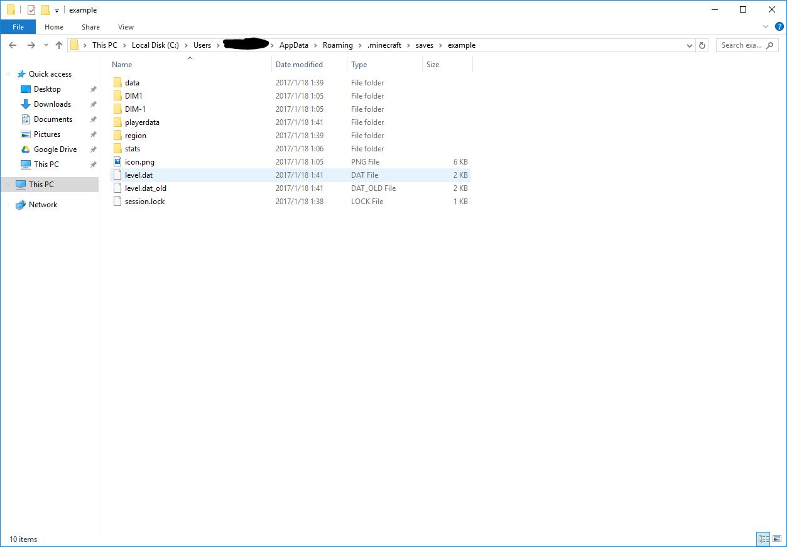
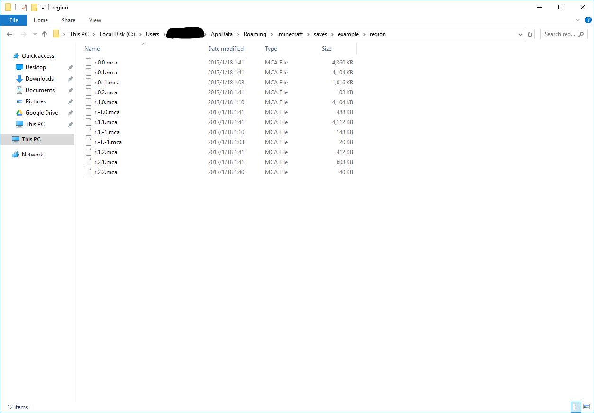

# THIS PROJECT IS DEPRECATED. YOU ARE WELCOMED TO FORK OR PULL REQUEST, BUT I WILL NOT MAINTAIN THE CODE ANYMORE, SORRY.

# LevelDb2Anvil

Convert **Minecraft: Pocket Edition Maps(_LevelDB_)** to **Minecraft Maps(_Anvil_)**.

## Info:

Latest version(v2.0) works for maps generated by Minecraft: Pocket Edition 1.0 or later.

Blocks have different ID in PC and PE will be converted into correct ID, no worry.

For Minecraft: Pocket Edition before v1.0 and after v0.9, consider using last build(v1.0).

Any question, bug or advice, feel free to talk with me at [here](https://github.com/ljyloo/LevelDb2Avnil/issues).

## Known Issues:

- ~~Block light and sky light will always be 15 (Still don't know how to get the data from Mojang's LevelDB database so I just set it 15)~~
  Checkout [here](https://github.com/ljyloo/LevelDb2Avnil/pull/19)
- **No entities**
- **Player will not spawn at the same coordinate like before**
- **Items in the chest will disappear**
- ~~No biome~~
- **Lag when first time load**
- **Crash(super rare!)**

## Usage:

### Video tutorial
There's a video tutorial about this(Made by AntVenom): [Link](https://www.youtube.com/watch?v=EFAkc5L4h48)

### Auto script
Import your LevelDB world in and rename it to the name 'world'.
Run start.bat(if you're on Windows) or start.sh(if you're on OS X or Linux) and the converter will now convert it to Anvil format to the output folder of 'worldanvil'.

### Command line interface
If you were familiar with command line interface, using the Converter.jar like this(You may want to [install java runtime first](java.com)): 

```
java -jar Converter.jar <import folder> <export folder>
```

## Todo

- [ ] **Fix light data**
- [ ] **Fix player coordinate**
- [ ] **Fix entities**
- [ ] **Fix items contained in the chest**
- [x] **Fix biome**
- [x] **Refactor the code**
- [ ] **Graphical user interface**

## Screenshots:

The mca files generated by the program stores your maps data. They can be found in an usual Minecraft world folder:




Create a superflat new world and copy the mca files into it, open the game and locate your chunks.(Press F3 to see your location)
Don't worry if you were seeing the flat chunks again, the coordinate of your original chunk in the MCPE is exactly the same in here too, you may want to use teleport command to find the chunks.

## Credits:

This program uses leveldb by tinfoiled. See lisense [here](https://github.com/ljyloo/leveldb)

This program contains code from Mojang: source at [here](https://mojang.com/2012/02/new-minecraft-map-format-anvil/)

User-friendly start.bat/start.sh, the folder 'worldanvil' was by @keithkfng.

Thanks AntVenom for making a video tutorial.
